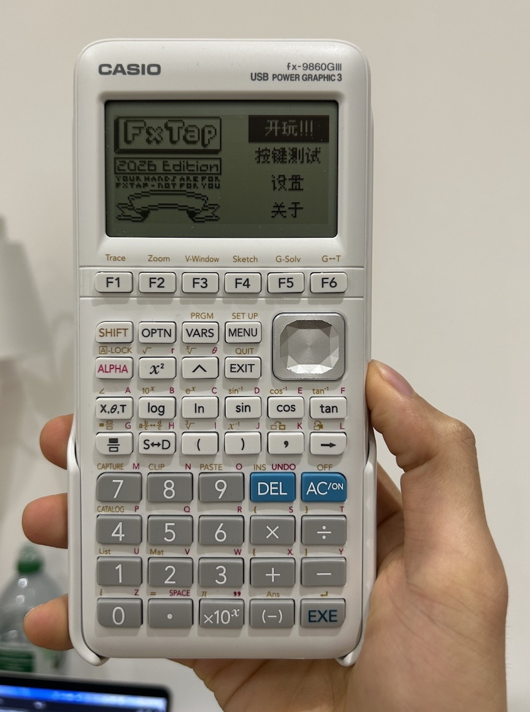

# fxTap

A rhythm game on CASIO calculators,
the successor of [fx4K](https://github.com/SpeedyOrc-C/fx4K).



## Features

- Support 1K to 9K.
- Support beatmania IIDX & DJMax column mapping.
- Support Overall Difficulty.
- Customisable key mapping, note falling speed, column width and tap note height.
- Support pausing.
- Walking the file system to find out all your beatmaps.
- Previewing beatmap.
- Saving grades.
- English & Chinese UI.

# How to play?

Please go to wiki.

# Beatmap Index

[fxTap Index](https://github.com/SpeedyOrc-C/fxTap-Index)

Here you can find some beatmaps ready to play,
especially if you don't want to convert the beatmaps by yourself.

# Build

Set up [fxSDK](https://git.planet-casio.com/Lephenixnoir/fxsdk) first. And then clone
dependency [fxTap Core](https://github.com/SpeedyOrc-C/fxTap-Core) inside this folder.

```sh
git clone https://github.com/SpeedyOrc-C/fxTap-Core
```

Run this command to build the executable `fxTap.g1a`.

```sh
fxsdk build-fx
```
