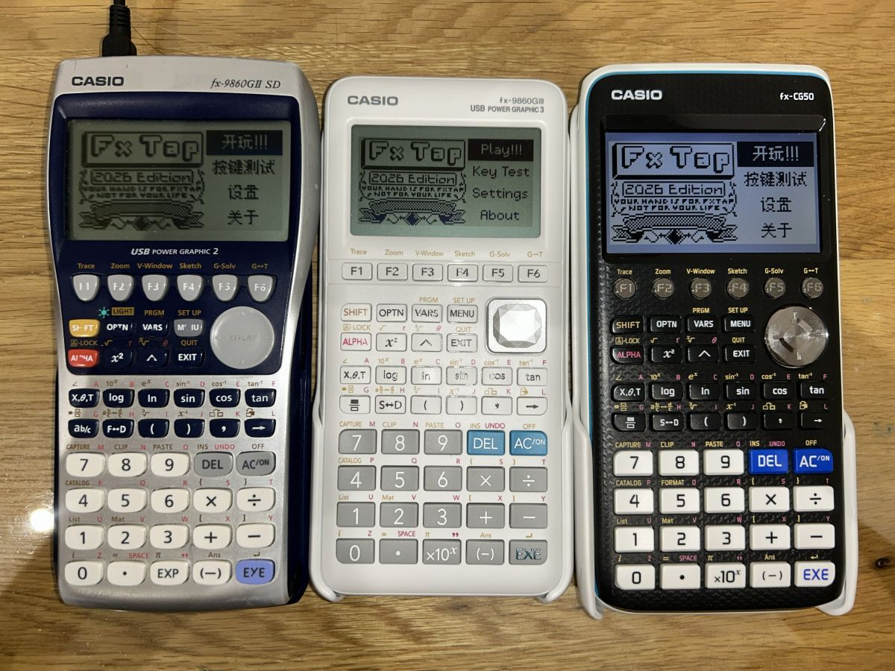
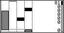
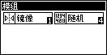

# fxTap

在卡西欧计算器上的音游，同时也是 [fx4K](https://github.com/SpeedyOrc-C/fx4K) 的续作。



## 功能

- 支持一键至九键。
- 支持 beatmania IIDX 和 DJMax 的轨道映射。
- 支持谱面的准度要求。
- 可自定义的按键映射、下落速度、音符的高度与轨道的宽度。
- 模组：
  - 镜像、随机
  - 上隐、下隐、反转
  - 无尾判、无长按
- 支持暂停。
- 会自动在文件系统里面搜索所有的谱面。
- 查看谱面元数据。
- 支持保存成绩。
- 查看误差分布的直方图。
- 英文和中文用户界面。

## 截图

| 游玩画面                          | 设置                                      |
|:----------------------------------|:------------------------------------------|
|       |  |
|  |   |
|          |            |
|     |                                           |

前往[画廊](Gallery)查看更多截图……

## 怎么玩？

请前往 Wiki 查看。

# 谱面目录

[fxTap Index](https://github.com/SpeedyOrc-C/fxTap-Index)

如果你不想自己转换谱面的话，这里有一些能直接开始玩的谱面。

# 构建

先用 [fxSDK](https://git.planet-casio.com/Lephenixnoir/fxsdk) 搭建开发环境。然后把依赖
[fxTap Core](https://github.com/SpeedyOrc-C/fxTap-Core) 下载到这个文件夹里。

```sh
git clone https://github.com/SpeedyOrc-C/fxTap-Core
```

运行这个命令来编译 `fxTap.g1a`。

```sh
fxsdk build-fx
```

# 相关项目

- 转谱器：[fxTap Adapater](https://github.com/SpeedyOrc-C/fxTap-Adapter)
- 核心库：[fxTap Core](https://github.com/SpeedyOrc-C/fxTap-Core)
- 本仓库的其他位置
    - [卡西欧星球](https://git.planet-casio.com/Chen-Zhanming/fxTap)
    - [GitHub](https://github.com/SpeedyOrc-C/fxTap)
